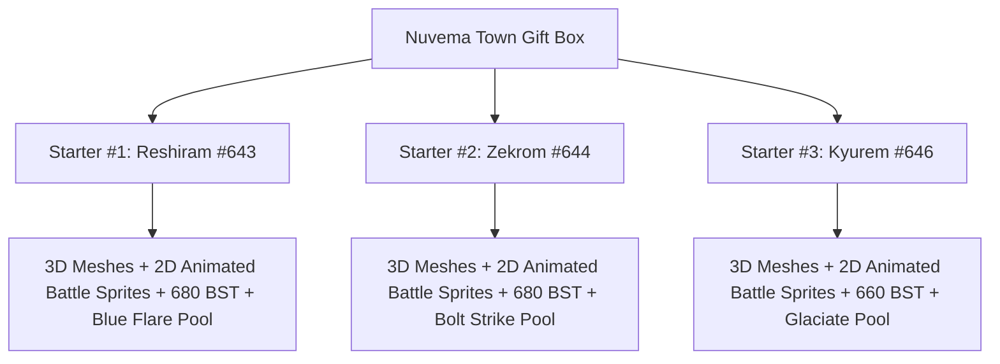

# Pokémon Black: Legendary Edition (Web & Engine)

[](https://pokemon-black-legendary-edition.vercel.app/)
[](https://github.com/Steve-IX/Pokemon-Black-Legendary-Edition)

🎮 **Play Live In-Browser**: [https://pokemon-black-legendary-edition.vercel.app/](https://pokemon-black-legendary-edition.vercel.app/)

A fully reverse-engineered, custom modified edition of **Pokémon Black Version** (`IRBO`) that replaces starter selection mechanisms with authentic **680 Base Stat Total (BST)** Legendary Pokémon, complete with 3D model overrides, 2D in-battle animated sprite sheets, native Level 70 signatures, and in-browser WebAssembly emulation.

---

## 🌟 Key Features & Modifications

### 1. In-Browser WebAssembly Emulation (Vercel Ready)
- **Play Anywhere**: Run directly in modern web browsers (Chrome, Firefox, Safari, Edge) without local emulator installation.
- **Wasm Dual-Screen Architecture**: Full Nintendo DS dual-screen rendering (Top 3D View + Bottom Touchscreen).
- **Responsive Layout Engine**: Dynamic toggle between **Standard Vertical DS View** and **Widescreen Side-by-Side Mode**.
- **Cross-Origin Multi-Threading**: Pre-configured with `COOP` / `COEP` service workers for multi-threaded WebAssembly execution and zero latency.
- **Zero-Limit ROM Streaming**: Employs parallel chunk decompression to stream the 256MB ROM across global CDNs with fast loading times.

### 2. Reverse-Engineered Legendary Starters



- **Starter #1 (Left Poké Ball)**: **Reshiram** (`#643`)
  - Typing: `Dragon / Fire` • BST: `680` • Ability: *Turboblaze*
  - Authentic Signature Pool: *Blue Flare, Fusion Flare, Dragon Pulse, Extrasensory*
- **Starter #2 (Middle Poké Ball)**: **Zekrom** (`#644`)
  - Typing: `Dragon / Electric` • BST: `680` • Ability: *Teravolt*
  - Authentic Signature Pool: *Bolt Strike, Fusion Bolt, Dragon Pulse, Zen Headbutt*
- **Starter #3 (Right Poké Ball)**: **Kyurem** (`#646`)
  - Typing: `Dragon / Ice` • BST: `660` • Ability: *Pressure*
  - Authentic Signature Pool: *Glaciate, Blizzard, Ice Beam, Dragon Pulse*

### 3. Comprehensive Visual & Asset Overhauls
- **3D Preview Models (`NARC 250` / `a/0/0/8`)**: Overrode both the inactive stage silhouettes and the active 3D rotating pedestal meshes with exact Legendary models.
- **2D In-Battle Animated Sprites (`NARC 246` / `a/0/0/4`)**: Overwrote all 20 animation files per Pokémon (front/back frames, shiny sheets, `NCER` cells, `NANR` animations, and `RLCN` palettes).
- **Opening Rival Battles**: Bianca & Cheren opening battle configurations in `NARC 335` boosted to **Level 70** with signature moves.

---

## 🎮 PC Controls Guide

| Nintendo DS Button | Keyboard (Primary) | Keyboard (Secondary) | Gamepad |
| :--- | :--- | :--- | :--- |
| **D-Pad (Move)** | `Arrow Keys` | `W` / `A` / `S` / `D` | D-Pad / Left Analog |
| **A (Interact / Confirm)** | `X` | `K` | `A` (Xbox) / `✕` (PS) |
| **B (Cancel / Run)** | `Z` | `J` | `B` (Xbox) / `○` (PS) |
| **X (In-Game Menu)** | `S` | `I` | `X` (Xbox) / `□` (PS) |
| **Y (Registered Item)** | `A` | `U` | `Y` (Xbox) / `△` (PS) |
| **L / R Bumpers** | `Q` / `E` | `Shift` | `LB` / `RB` |
| **Start** | `Enter` | `Enter` | `Start` / `Options` |
| **Select** | `Space` | `Backspace` | `Select` / `Share` |
| **Touchscreen / Stylus** | **Mouse Click & Drag** | Touch | Touch |

---

## 🛠️ Reverse Engineering Architecture & Tools

This repository contains the full programmatic toolchain used to reverse-engineer and rebuild the ROM:

- [`tools/nds_pokemon_customizer.py`](tools/nds_pokemon_customizer.py): NitroFS FAT parser, NARC unpacker/packer, 3D model & 2D battle sprite injector, and stat recalculator.
- [`tools/game_runner.py`](tools/game_runner.py): Desktop emulator launcher, process supervisor, and binary save injector.
- [`tools/memory_tracer.py`](tools/memory_tracer.py): Real-time ARM9 RAM inspector for emulator process debugging.
- [`docs/REVERSE_ENGINEERING_REPORT.md`](docs/REVERSE_ENGINEERING_REPORT.md): Complete technical breakdown of Nintendo DS file tables, encryption schemes, and memory structures.

---

## 🚀 How to Run & Deploy

### Local Development Server
```bash
# Serve static files locally
npx serve .
```
# Install dependencies & run local server with Cross-Origin Isolation headers
npm start
# (or: node server.js)
```
Visit `http://localhost:3000` in your web browser.

### Deploy to Vercel

#### Option 1: Vercel Dashboard (GitHub Sync)
1. Push this repository to GitHub: `Steve-IX/Pokemon-Black-Legendary-Edition`.
2. Open [Vercel Dashboard](https://vercel.com) $\rightarrow$ Click **Add New Project**.
3. Import `Steve-IX/Pokemon-Black-Legendary-Edition`.
4. Keep default settings (Framework: *Other*, Root Directory: `./`) and click **Deploy**.

#### Option 2: Vercel CLI
```bash
npx vercel
# For production:
npx vercel --prod
```

---

## 📜 License
Educational reverse engineering and web emulation showcase. Pokémon and Nintendo DS are registered trademarks of Nintendo and Game Freak.

Open `http://localhost:3000` in your web browser.

Open `http://localhost:3000` in your web browser.
