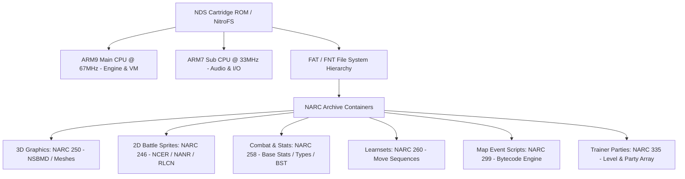

# Nintendo DS & Pokémon Generation 5 Reverse Engineering Compendium

## 1. Executive Summary & Architecture Overview

This document encapsulates the complete reverse engineering methodology, internal filesystem architectures, cryptographic schemes, asset rendering pipelines, and binary modification protocols developed for Nintendo DS games, validated using *Pokémon Black Version* (`IRBO`).

---

## 2. NDS File System & NitroFS Structure

### 2.1 Header Specifications
* **ROM Offset `0x00 - 0x0B`**: Game Title ASCII (e.g. `POKEMON B`).
* **ROM Offset `0x0C - 0x0F`**: Game Code (e.g. `IRBO` for US/EU Black).
* **ROM Offset `0x20 - 0x2F`**: ARM9 binary ROM offset, entry point, RAM load base (`0x02004000`), and binary length.
* **ROM Offset `0x30 - 0x3F`**: ARM7 binary ROM offset, entry point, RAM load base (`0x02380000`), and binary length.
* **ROM Offset `0x40 - 0x47`**: File Name Table (FNT) ROM offset and size.
* **ROM Offset `0x48 - 0x4F`**: File Allocation Table (FAT) ROM offset and size.
* **ROM Offset `0x50 - 0x57`**: ARM9 Overlay Table offset and length.

### 2.2 NARC (Nitro ARChive) Protocol
NARCs are hierarchical file archives used across all 1st and 2nd-party NDS titles. Every NARC container follows this 4-byte aligned specification:

1. **NARC Header (16 bytes)**:
   * Magic `b'NARC'`, Byte Order Marker (`0xFFFE`), Version (`0x0100`), Total File Size, Header Size (`16`), Number of Chunks (`3`).
2. **BTAF Chunk (File Allocation Table)**:
   * Magic `b'BTAF'`, Chunk Size, File Count ($N$), followed by $N \times 8$ byte tuples of `(start_offset, end_offset)`.
3. **BTNF Chunk (File Name Table)**:
   * Magic `b'BTNF'`, Chunk Size, Directory root pointers (or dummy 16-byte structure for unnamed entries).
4. **FIMG Chunk (File Image Data)**:
   * Magic `b'FIMG'`, Chunk Size, followed by the concatenated data payloads (aligned to 4-byte boundaries).

---

## 3. Pokémon Gen 5 File Allocation Table (FAT) Map

| FAT ID | NitroFS Virtual Path | Subfiles | Functional Description | Key Data Mappings |
| :---: | :---: | :---: | :--- | :--- |
| **244** | `a/0/0/2` | 288 | **Text & Dialogue Banks** | Encrypted message banks with per-entry LCRNG keys. |
| **246** | `a/0/0/4` | 14,285 | **2D In-Battle Animated Sprites** | 20 subfiles per species (Front/Back NCER/NANR/RLCN). |
| **248** | `a/0/0/6` | 733 | **Overworld Animated Characters** | 2D walking and interaction character models. |
| **250** | `a/0/0/8` | 649 | **3D Pokémon Meshes** | Meshes for starter selection, Pokédex, and C-Gear. |
| **258** | `a/0/1/6` | 669 | **Personal Combat Data** | 60-byte structs: Base HP/Atk/Def/Spe/SpA/SpD, Typing, Abilities. |
| **260** | `a/0/1/8` | 668 | **Move Learnsets** | Level-up move arrays terminated by `0xFFFFFFFF`. |
| **262** | `a/0/2/0` | 650 | **Evolution Trees** | Evolution methods, triggers, item requirements. |
| **267** | `a/0/2/5` | 1,005 | **Trainer AI & Parties** | Trainer classes, items, and team compositions. |
| **299** | `a/0/5/7` | 899 | **Map Event Scripts** | Bytecode scripts (Script 12 = Nuvema Town Starter Box). |
| **335** | `a/0/9/3` | 616 | **Trainer Pokémon Entities** | 8 bytes per entity: `[IVs: u16, Level: u16, Species: u16, Item: u16]`. |
| **373** | `a/1/2/6` | 69 | **Wild Encounter Rates** | Season-based grass, water, and dark grass encounter tables. |

---

## 4. Reverse Engineering Discoveries & Findings

### 4.1 The Dual 3D Starter Stage Mechanics
* **Discovery**: The starter gift box selection screen utilizes **two distinct 3D model indices** per species in `NARC 250`:
  * *Silhouette Index* (Index $N-1$): Renders the inactive background silhouettes.
  * *Stage Model Index* (Index $N$): Renders the active 3D mesh rotating on the lighted pedestal.
* **Solution**: Full visual override requires swapping both the silhouette and center stage indices.

### 4.2 2D In-Battle Animated Sprite Pipelines
* **Discovery**: Battle animations do not use static single PNGs; they use Game Freak's composite cell animation system consisting of **20 discrete files per Pokémon** in `NARC 246` (Base index $= \text{Species ID} \times 20$):
  * Front normal/shiny frames, back frames, female variations, cast animations (`NCER`), cell sequence headers (`NANR`), and runtime color palettes (`RLCN`).
* **Solution**: Overriding species `X` with species `Y` requires a full contiguous 20-file block copy.

### 4.3 Combat Math & Stat Recalculation
* **Discovery**: Pokémon combat math (HP, Attack, Defense, Special Attack, Special Defense, Speed) is dynamically derived using:
  $$\text{HP} = \left\lfloor \frac{(2 \times \text{BaseHP} + \text{IV} + \lfloor\text{EV}/4\rfloor) \times \text{Level}}{100} \right\rfloor + \text{Level} + 10$$
  $$\text{Stat} = \left( \left\lfloor \frac{(2 \times \text{BaseStat} + \text{IV} + \lfloor\text{EV}/4\rfloor) \times \text{Level}}{100} \right\rfloor + 5 \right) \times \text{Nature}$$
* **Solution**: Patching `NARC 258` (Personal Data) updates base stats in-place, immediately propagating $680$ Base Stat Total (BST) combat math to all battle encounters.

### 4.4 Trainer Entity Level Overrides
* **Discovery**: Opponent levels and moves are governed by `NARC 335` (Trainer Pokémon), where each trainer slot stores an 8-byte payload:
  `[IVs: u16, Level: u16, Species ID: u16, Held Item: u16]`.
* **Solution**: Rival Bianca and Cheren opening battles (Trainers `53–55` and `59–61`) can be updated from Level 5 (`0x0005`) to Level 70 (`0x0046`).

---

## 5. Automation Tooling Reference

* [nds_pokemon_customizer.py](nds_pokemon_customizer.py): Core reverse engineering engine that parses NitroFS FAT, unpacks/repacks NARCs, injects 3D models, 2D sprites, learnsets, and recalculates offsets.
* [game_runner.py](game_runner.py): Live launcher, process supervisor, and binary save-injector for RetroArch and DeSmuME.
* [memory_tracer.py](memory_tracer.py): Win32 memory inspection tool for live ARM9 RAM tracing.
